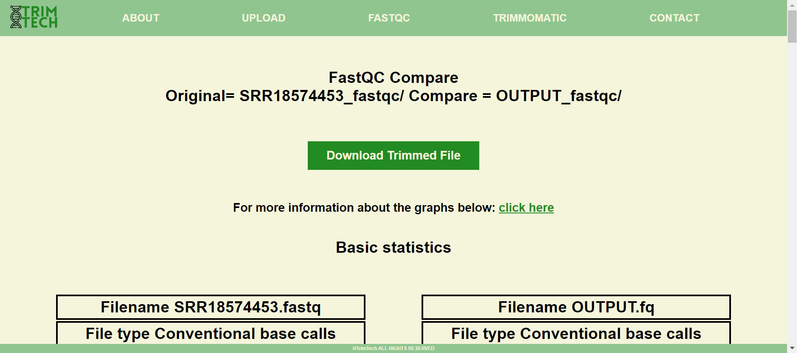

# **Bio-informatics Toolbox Website: TrimTech**

### **Authors:** Ivar Lottman, Storm Steller, Kasthury Inparajah & Mirte Draaijer 
### **Version:** 0.1.7
### **Date:** 14/3/2024

___

## **Name and usage**
### **TrimTech**
#### TrimTech is used for quality control and trimming FASTQ files before the mapping and coverage phase of the data.
#### We created this website because not all of the data produced by sequencing is 100% accurate and when you want to do mapping and covarage of a reference genome you want to use the accurate data. Therefore this tool was created to do the quality control of the data. 

#### It does this by visualising the FastQ data with a tool called FastQC and another tool called Trimommatic for trimming the FastQ data based on input commands. 


## **Programmer/ICT user manual**

### **Homepage TrimTech**

#### The colored buttons on TrimTech website are linked to seperate pages. The "TRY IT NOW!" button leads to the upload page of TrimTech, while the "HOW DOES IT WORK?" button provides an explanation of how TrimTech works. The "DISCLAIMER" button leads to the disclaimer page, and the "GET YOUR FASTQ FILE HERE!" button redirects to the NCBI site. 

#### The navigation bar on top of the page allows the user to visit different pages by clicking on the available options. 

#### Here is an overview of where the options on the navigation bar redirects to:

* #### **ABOUT** --> The aboutpage
* #### **UPLOAD** --> The uploadpage
* #### **FASTQC** --> Informationpage about FastQC
* #### **TRIMMOMATIC** --> Informationpage about TRIMMOMATIC
* #### **CONTACT** --> The contactpage 


### **Aboutpage**


#### This webpage provides details about TrimTech.


### **Uploadpage**


#### The user can upload the FASTQ file by clicking on the "Choose file" button, selecting the file, and then clicking on the submit button.


### **Succesfull uploaded**


#### The rendered webpage, as shown above, will appear once you have successfully uploaded your FASTQ file. This indicates that your file was valid and has been successfully processed by FastQC. If the user wishes to trim the data to improve the data quality, they can do so by clicking on the "TRIM THE DATA" button, which will take them to the trimming options webpage.


### **Invalid file webpage**


#### If you upload an invalid file to TrimTech, you will see a webpage displaying the name of the invalid file at the top. To retry, you can click on the "Click here to try again" link or "About" option on the navigation bar to go back to the uploadpage and upload a valid file.


### **Trimming options**


#### Users can select data trimming values on the Trimming optionspage and initiate the trimming process by clicking "START". FASTQC will then read the trimmed data.


### **Comparepage**


#### The comparepage displays the quality of the uploaded FASTQ file pre and post-trimming.


### **FASTQC**


#### This webpage provides detailed information about FastQC, a tool implemented in TrimTech, including the plots generated by FastQC. 


### **TRIMMOMATIC**


#### This webpage provides detailed information about TRIMMOMATIC, another tool implemented in TrimTech.


### **Contactpage**


#### Users can get in touch with the creators of TrimTech by clicking on the GitHub logo which will redirect the users to the Github repository of this website. 


## **GUI input file**


## **FASTQC based commands**

## **Trimmomatic**
### **In- and output**
#### Trimmomatic works with FASTQ, using phred - 33 or phred - 64 quality scores. The FASTQ can be either uncompressed or zipped. The use of the gzip format is determined based on the .gz extension.

#### Once you have performed the command, an output file will be created in the directory you are currently in. This output file can be an uncompressed FastQ or a gzipped FastQ, depending on how you specified the output in your command. This output can be used in programms like FastQC to recheck the quality of the sequence.

### **Usage**
#### To use Trimmomatic, go to the terminal of your OS. The command needed to run Trimmomatic depends on if your data is single- or paired end. 

### **Single-end**
#### If your data is single end, use te following example:
```java -jar trimmomatic-0.39.jar SE -phred33 "input.fq.gz" "output.fq.gz" ILLUMINACLIP:TruSeq3-SE:2:30:10 LEADING:3 TRAILING:3 SLIDINGWINDOW:4:15 MINLEN:36```

#### Single ended data only takes 1 input, a FastQ file, and gives 1 output back, a trimmed version of the sequence. You will need to change input.fq.gz to the name of your desired FastQ file. You can also change the name of the output.fq.gz to your desired name, but this is optional. 

#### You can also change the extension of your output. If you want it to be uncompressed, use .fq of fastq. If you want it to be compressed in a gzip, use .fq.gz or .fastq.gz.

### **Paired end**
#### If your data is paired end, use this example:

```java -jar trimmomatic-0.39.jar PE "input_forward.fq.gz" "input_reverse.fq.gz" "output_forward_paired.fq.gz output_forward_unpaired.fq.gz output_reverse_paired.fq.gz" "output_reverse_unpaired.fq.gz" ILLUMINACLIP:TruSeq3-PE.fa:2:30:10:2:True LEADING:3 TRAILING:3 MINLEN:36```

#### Paired ended data takes 2 inputs, the forward sequence and the backward sequence. This command gives you 4 outputs, a paired sequence, where both reads survived the processing, and  an unpaired sequence where only one read survived but not its partner read, of the forward- and backward sequence.

### **Trimommatic based commands**

#### The following arguments are mostly used in Trimmomatic:
#### • **ILLUMINACLIP:** Cuts adapters and other illumina-specific sequences from the read. (ILLUMINACLIP:TruSeq3-PE.fa:2:30:10) 

#### • **LEADING:** Cuts bases off the start of a read, if it is below a threshold quality. (LEADING:3) 

#### • **TRAILING:** Cuts bases of the end of a read, if it is below a threshold quality. (TRAILING:3) 

#### • **SLIDINGSHOW:** Performs a sliding window trimming, cuts if the average quality within the window is bellow a threshold (SLIDINGWINDOW:4:15) The first argument is the size of the window. The argument is the threshold quality.

#### • **MINLEN:** Drop the read if it is below the specified length. (MINLEN:36)

#### The following arguments are not used often, but it is good to know about them:
#### • **CROP:** Cuts the read to a specified length. (CROP:10) • HEADCROP: Cuts the bases off the end of a read if below a threshold quality. (HEADCROP:15) 

#### • **TOPHRED33:** Converts the quality score to Phred-33 • TOPHRED64: Converts the quality score to Phred-64. If no phred score is specified, Trimmomatic will default to phred + 33.


## **Installation** *(expanded manual)*

#### **INSTALL THE TOOLS BELOW INTO THE "TOOLS" FOLDER.**

### **Install Java**

#### Please make sure to have installed Java on your computer since Jave is needed to run both FastQC and Trimmomatic. You can donwload Java from the following website: website: https://www.java.com/nl/. **Please note that Trimmomatic requires Java 1.8 or higher!**

### **FastQC**
#### This manual was written based on the official instructions for installing FastQC, so if you want you can follow those: https://raw.githubusercontent.com/s-andrews/FastQC/master/INSTALL.txt

#### **Installation**
#### **1.** Make sure you have downloaded Java. If not, please download Java from the following website:  https://www.java.com/nl/. 
#### **2.** Download FastQC (version 0.12.1 or higher) from the following website: https://www.bioinformatics.babraham.ac.uk/projects/download.html#fastqc
#### **Make sure you download the correct version for your operating system (Linux, Windows or Mac)!**
#### **3.** When you have downloaded the FastQC file from the website, you need to unzip it.
#### **4.** After unzipping, FastQC is ready to go.

### **Trimommatic**
#### This manual was written based on the instructions for installing Trimmomatic, so if you want you can follow those: http://www.usadellab.org/cms/uploads/supplementary/Trimmomatic/TrimmomaticManual_V0.32.pdf

#### **Installation**
#### **1.** To install Trimmomatic, go to http://www.usadellab.org/cms/?page=trimmomatic and download a binary release zip of Trimmomatic of version 0.39 or higher. 
#### **2.** Unpack the zip in a convenient folder.
#### **3.** Once installed and unpacked, you can acces Trimmomatic using the terminal of your OS.


## **Systeem requirements**
### Tested on: Windows 10 and 11
### Linux Debian v12


## **Hardware requirements**
### No specific requirements


## **Installation Manual short**

#### **INSTALL THE TOOLS BELOW INTO THE "TOOLS" FOLDER.**

### **Java** *(v1.8.0_401)*
#### Follow the install manual from the official Java website:
https://www.java.com/nl/download/

### **Python** *(v3.11.8)*
#### Follow the install manual from the official Python website:
https://www.python.org/downloads/

### **FastQC** *(v0.12.1)*
https://www.bioinformatics.babraham.ac.uk/projects/fastqc/

### **Trimmomatic** *(v0.39)*
http://www.usadellab.org/cms/?page=trimmomatic

## **Module discription**
#### Commandline: Scriptname
TO DO: PER SCRIPT, WEBSITE SCRIPT, TOOL SCRIPT AND FLASK VERSION

## **DISCLAIMER: TRIMTECH ONLY USES INPUT FROM ILLUMINADATA**

## **Support**
#### If you want to share your thoughts or if any questions arise, please contact us via our Github page: 
#### https://github.com/KasthuryI/Bio-informatica-toolbox


## **Acknowledgment**
#### We would like to express our sincere appreciation to our teachers, Mr. Wedema and Mr. Kroon, for expertly guiding us through this project. 

#### We would also like to acknowledge the following websites for their valuable resources and assistance during the development of this project:

#### W3 SCHOOLS: https://www.w3schools.com/
#### FASTQC: https://www.bioinformatics.babraham.ac.uk/projects/fastqc/Help/
#### Trimmomatic: http://www.usadellab.org/cms/?page=trimmomatic
#### Explanation Trimmomatic: https://www.ncbi.nlm.nih.gov/pmc/articles/PMC4103590/#btu170-B5
